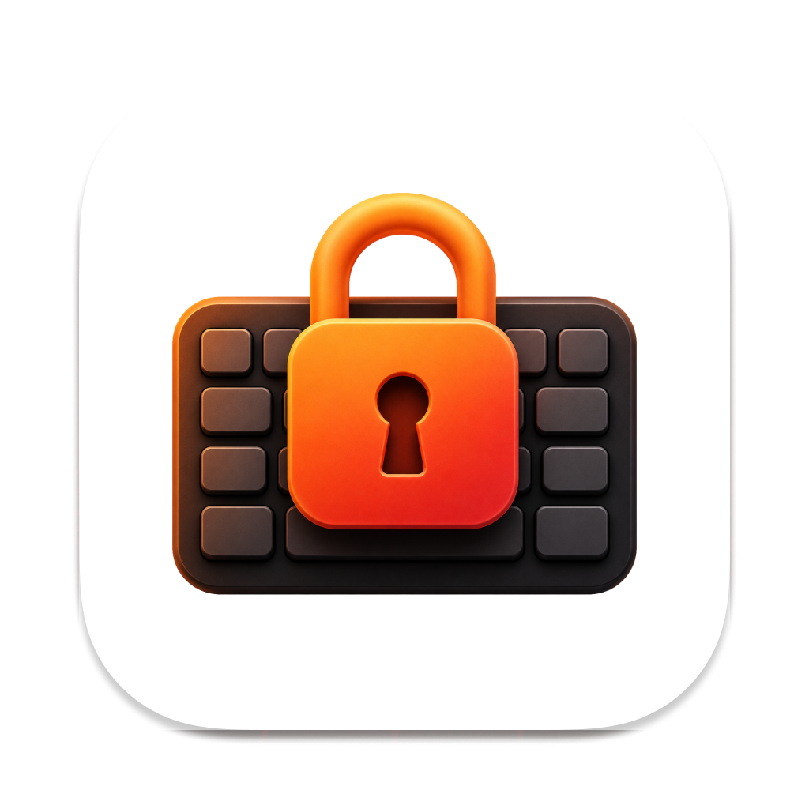

# KeyClean

<p align="center">
  
</p>

<p align="center">
  <a href="https://github.com/burakereno/keyclean/releases/latest/download/KeyClean.dmg">
    
  </a>
  <a href="https://github.com/burakereno/keyclean/releases/latest">
    
  </a>
</p>

KeyClean is a tiny macOS menu bar utility that temporarily blocks keyboard input while you clean your keyboard. Pointer input stays available, so you can always unlock from the menu bar.

## Features

- Menu bar only: no Dock icon, no full app window.
- Blocks keyboard events with a local CoreGraphics event tap.
- Keeps mouse and trackpad input active.
- Emergency unlock by holding ESC for 3 seconds.
- Checks GitHub releases for updates and installs the latest DMG from the app.

## Install

1. Download [KeyClean.dmg](https://github.com/burakereno/keyclean/releases/latest/download/KeyClean.dmg).
2. Open the DMG and drag **KeyClean.app** to Applications.
3. Launch KeyClean. It appears as a small lock icon in the menu bar.

Release downloads are Developer ID signed and notarized.

## Permissions

KeyClean needs macOS permission before it can intercept keyboard input:

- **Accessibility** allows KeyClean to discard key events while locked.
- **Input Monitoring** is required by newer macOS event taps.

Open KeyClean from the menu bar and use the permission buttons in the panel. After granting permission, you may need to quit and reopen the app once for macOS to refresh the trust state.

## Updates

KeyClean checks the latest GitHub release periodically. When a newer version is available, an **Update** button appears in the menu bar panel. The installer verifies the downloaded app bundle identifier and version before replacing the installed app.

## Build From Source

Requirements:

- macOS 14.0 or later
- Xcode command line tools
- Swift 5.9 or later

Build and launch a signed local development app:

```bash
./script/build_and_run.sh
```

Build a release-style app bundle:

```bash
./scripts/build-app.sh
```

Release builds are created automatically by GitHub Actions on pushes to `main`. The workflow increments the patch version, tags the commit, builds a Developer ID signed and notarized `KeyClean.app`, packages `KeyClean.dmg`, notarizes and staples the DMG, and publishes a GitHub release.

Signing setup is documented in [docs/release-signing.md](docs/release-signing.md).
